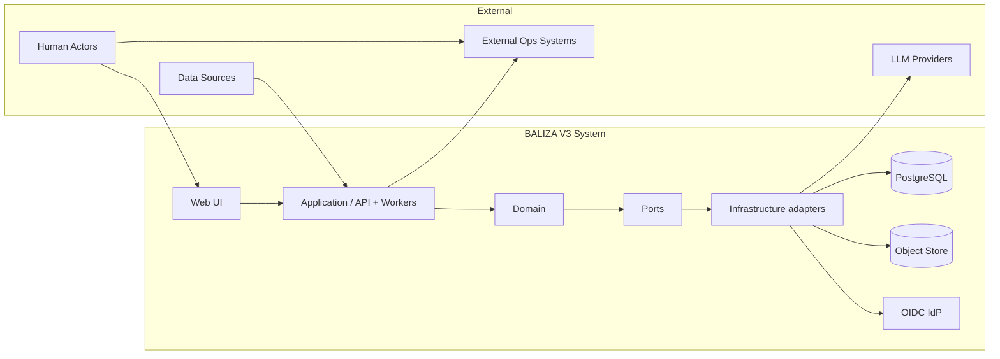
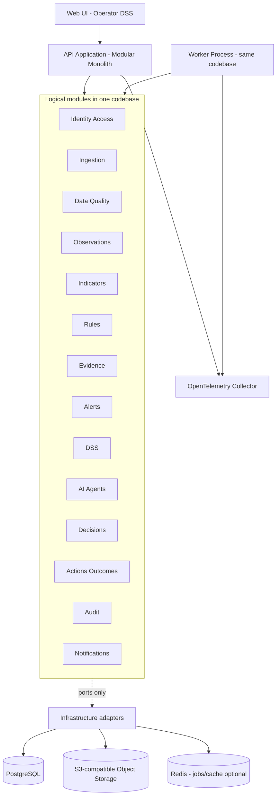

# 12 — Technical Architecture (Phase 2)

## Status

**Phase 2 — Technical Architecture — COMPLETED.**  
**Phase 2.5 freeze:** [14-architecture-review.md](./14-architecture-review.md).  
Domain soft freeze: [11-domain-review.md](./11-domain-review.md).  
ADRs: [architecture/](./architecture/).

No application code, infrastructure as code, or deployments are produced in this phase.

---

## 1. Goals

1. Implement the frozen BALIZA domain without distorting Evidence Chain, HITL, or epistemic separation.
2. Enable a **real pilot** with a small team and modest ops burden.
3. Keep the **critical alert path deterministic** (Rule Engine), independent of LLMs.
4. Preserve **reproducibility** (RuleVersion, IndicatorVersion, snapshots) and **Decision-time freeze** (Inv 17).
5. Remain **portable** and evolvable (extract modules later without rewriting domain).
6. Satisfy acceptance criteria A–J (§28 of the Phase 2 brief / §21 below).

---

## 2. Non-goals

- Microservices mesh / multi-region HA for day one.
- Event sourcing as the system of record.
- Building a full GIS platform.
- Production multi-tenant SaaS isolation (optional `tenant_id` only).
- Offline-first edge product (classified later unless pilot mandates).
- Implementing rules DSL, agents, APIs, or UI in this phase.
- Choosing cloud vendor lock-in as an architectural necessity.

---

## 3. Architecture principles

1. **Domain first** — modules mirror domain boundaries; tech serves domain.
2. **Dependency rule** — `UI → Application → Domain → Ports → Infrastructure adapters`. Domain never imports UI, DB drivers, LLM SDKs, Redis, S3, FastAPI, OIDC, or cloud SDKs. Workers call the same application/domain services as the API.
3. **Deterministic critical path** — Alert creation for critical severity from RuleEvaluation only.
4. **Assistive AI** — AgentRun → Analysis/Recommendation only; never Decision/Action.
5. **Append / version** — published definitions immutable; evaluations and snapshots durable.
6. **Explicit clocks** — never collapse temporal semantics to a single `created_at`.
7. **Failure ≠ no risk** — degraded/unknown/insufficient_data are first-class states.
8. **Pilot simplicity** — one deployable + workers; extract services only when metrics justify.
9. **Provider replaceability** — LLM, object store, IdP behind interfaces.
10. **Test the domain in isolation** — pure domain tests without DB/LLM.

---

## 4. Context diagram



BALIZA **records** Actions/Outcomes; physical execution may remain outside.

---

## 5. Container / component diagram



**Deployment unit (pilot):** API container + Worker container + PostgreSQL + Redis + MinIO (or managed equivalents) via Compose.

---

## 6. Style comparison and recommendation

| Criterion | Modular Monolith | Microservices | Hybrid (monolith + workers/events) | Full Event-Driven |
|-----------|------------------|---------------|------------------------------------|-------------------|
| Complexity | Low–med | High | Med | High |
| Cost (ops) | Low | High | Low–med | Med–high |
| Dev speed (small team) | High | Low | High | Med |
| Testability | High (in-proc) | Harder E2E | High | Med |
| Traceability | Excellent if modules share tx | Risk of broken chains | Excellent with outbox | Good if disciplined |
| Observability | Simple | Many services | Simple + job metrics | Broker-centric |
| Deploy | One/few units | Many | Few | Broker + many |
| Scale | Vertical + workers | Independent scale | Scale workers first | High throughput |
| Isolation | Module boundaries | Process isolation | Module + async | Event contracts |
| Ops difficulty | Low | High | Low–med | Med–high |
| Small team | **Best fit** | Poor fit early | **Best fit** | Overkill early |
| BALIZA domain fit | Strong | Premature | **Strongest** | Useful patterns only |

### Recommendation: **Modular Monolith + async workers** (light hybrid)

**Why (domain-linked):**

- EvidencePackage, RuleEvaluation, Alert, DssPackage freeze, Decision, Action, Outcome often need **consistent transactions** and easy joins for reconstruction.
- AuditEvent and versioned definitions benefit from a **single relational store of record**.
- AgentRun and heavy ingest are **async** without splitting the domain into network services.
- Clear module packages allow **later extraction** (e.g., Rules or AI worker) when scale demands it — without rewriting domain types.

**Not chosen now:** microservices (ops tax unjustified); pure event-sourcing (complexity vs benefit); Kafka-centric EDA for MVP.

See [ADR-001](./architecture/ADR-001-architecture-style.md).

---

## 7. Module boundaries

Dependency direction: outer → inner. Domain modules may call each other only via **application services / domain services** with explicit APIs — no UI imports.

| Module | Responsibility | Inputs | Outputs | May modify | Must not modify | Depends on |
|--------|----------------|--------|---------|------------|-----------------|------------|
| **Identity/Access** | Actor, Role, permission checks | tokens, actor ids | authz decisions | Actor/Role assignments | Rules, Alerts, Decisions content | IdP adapter |
| **Ingestion** | Acquire raw payloads, provenance | sources, files, APIs | raw refs, ingest jobs | ingest staging, raw artifact refs | Alerts, Decisions | Observation ports; artifact **port** (not S3 SDK in domain) |
| **Data Quality** | Assess fitness | Observations / series | DataQuality records | DataQuality | Rule definitions | Observations |
| **Observations** | Persist Observation records | normalized payloads | Observation ids | Observations, Dataset links | Rules, Decisions | DataSource, DQ |
| **Indicators** | Compute IndicatorValues | Observations, IndicatorVersion | IndicatorValues | IndicatorValues | Rule thresholds | Observations, DQ |
| **Rules** | Evaluate RuleVersions | IndicatorValues, quality | RuleEvaluations | RuleEvaluations, draft RuleVersions* | Decisions, Actions | Indicators, DQ |
| **Evidence** | Build Items/Packages | refs to obs/ind/eval/analysis | EvidenceItem/Package | Evidence structures | Decision records | Rules, Observations, AI outputs (read) |
| **Alerts** | Lifecycle of Alerts | RuleEvaluations + Evidence | Alerts, status history | Alerts | Decisions, Actions | Evidence, Rules |
| **DSS** | Assemble DssPackage; **create** DssContextSnapshot at Decision | Alerts, Evidence, Protocols, Analyses | DssPackage, DssContextSnapshot | DssPackage (live); Snapshot **create-only** | Execute Actions; mutate existing snapshots | Alerts, Evidence, AI (read), Protocols |
| **AI/Agents** | AgentRun → Analysis/Recommendation | Dss/Evidence context | AgentRun, Analysis, Recommendation | **new** AI artifacts / analytical EvidenceItems only | Alerts critical path, Decisions, Actions, historical Evidence, RuleVersion | LLM **gateway port**, Evidence (read) |
| **Decisions** | Record Decision + snapshot bind | Actor, Dss snapshot, choice | Decision | Decisions | Auto-create from AgentRun | DSS, Identity |
| **Actions/Outcomes** | Record Action/Outcome | Decision, later obs | Action, Outcome | Action, Outcome | Invent Decisions | Decisions, Observations |
| **Audit** | Append AuditEvents | all modules | AuditEvent stream | AuditEvent only | Business entities’ meaning | — |
| **Notifications** | Notify Actors | alert/decision events | delivery attempts | notification log | Domain decisions | Alerts, Identity |

\*RuleVersion **activation** is governed (Identity + Audit); Rules module computes evaluations.

### Extraction seams (future)

Package-per-module (`baliza.domain.*`, `baliza.app.*`, `baliza.infra.*`). Sync in-proc calls today → message + HTTP later for AI worker or ingest without changing domain models.

---

## 8. Data architecture

**System of record:** PostgreSQL (relational).

**Why:** many-to-many Evidence Chain; transactional Decision+snapshot; version tables; AuditEvent append; temporal filters; optional PostGIS later; strong integrity.

**Document DB alone:** weaker relational integrity for RuleEvaluation↔Evidence↔Alert↔Decision; rejected as primary.

**Object storage:** large binaries (raw files, agent traces, embedded snapshot blobs if needed).

**Schemas (logical, not DDL):**

- `identity`, `catalog` (Entity/Zone/Station/DataSource), `data` (Observation/Dataset/DQ), `indicators`, `rules`, `evidence`, `alerts`, `dss`, `ai`, `decisions`, `audit`

**Multi-tenancy:** nullable `tenant_id` on scoped rows; no hard SaaS isolation for pilot.

See [ADR-003](./architecture/ADR-003-database.md), [ADR-004](./architecture/ADR-004-evidence-storage.md).

---

## 9. Evidence architecture

```text
Structured metadata  → PostgreSQL (EvidenceItem, EvidencePackage, gaps, conflicts, epistemic_label, version refs)
Large artifacts      → Object store (raw datasets, PDFs, agent trace bundles, optional frozen snapshot payloads)
```

- EvidenceItem always points to domain ids and/or object keys — **never prose-only** on critical path. Store `content_hash` for artifacts.
- EvidencePackage assembly is transactional with Alert creation when required (Inv 3).
- Agent outputs stored as Analysis/Recommendation rows + optional artifact objects; labeled INFERENCE/RECOMMENDATION. Agents must not mutate historical evidence.

---

## 10. Events and jobs

| Kind | Purpose | Example | MVP |
|------|---------|--------|-----|
| **Domain Event** | In-process notification of business fact | `RuleEvaluated`, `AlertCreated` | In-process bus / callbacks |
| **Integration Event** | Cross-boundary async | `NotificationRequested`, `IngestBatchReceived` | Outbox → worker (optional simple queue) |
| **AuditEvent** | Who/what/when/why/version | Decision recorded, RuleVersion activated | Append-only table (not the same as domain event) |

**Not** event sourcing for MVP.

**Jobs:** Redis-backed async workers for ingest, indicator recompute, AgentRun, notifications. **RuleEvaluation must remain executable in-process** against PostgreSQL without Redis. A worker may *schedule* evaluation; it must not be the only way to evaluate. Redis outage ≠ cannot evaluate rules.

See [ADR-005](./architecture/ADR-005-events-and-jobs.md).

---

## 11. Rules architecture

```text
Rule (identity) → RuleVersion (immutable published body: conditions, thresholds, evidence/quality requirements)
                      ↓
              RuleEvaluator (deterministic code)
                      ↓
              RuleEvaluation (inputs snapshot, thresholds applied, rule_id+version, evaluated_at)
                      ↓
              EvidenceItem(s) → EvidencePackage → Alert (critical path)
```

**Initial strategy:** declarative RuleVersion documents (YAML/JSON stored in DB) + **versioned evaluator code** in the Rules module. No external proprietary BRE. Evolve toward safer DSL if authors need it — without changing RuleEvaluation schema.

**Simulation:** evaluate against historical IndicatorValues in a dry-run mode writing to a simulation namespace (not production Alerts).

See [ADR-006](./architecture/ADR-006-rules-engine.md).

---

## 12. AI architecture

```text
Orchestrator → Agent (versioned config) → AgentRun
                    ↓
              Analysis / Recommendation (structured, labeled)
                    ↓
              EvidenceItem (analytical) / DssPackage enrichment
```

```text
RULE ENGINE ── critical alert path (deterministic)
AI ── analysis / context / explanation / recommendation only
```

- **LLM Gateway** adapter (provider-agnostic).
- Prompt/config **versioned** with AgentVersion.
- Structured outputs (schema validation); reject unlabeled/unsourced scientific claims at orchestrator.
- Guardrails: no tools that create Decision/Action/Alert(critical); timeout/budget; prompt-injection hardened tool allowlists.
- Failure of LLM → DSS still works with rules+evidence; mark AI section DEGRADED.

See [ADR-007](./architecture/ADR-007-ai-architecture.md).

---

## 13. DSS architecture

```text
Alerts + EvidencePackages + Protocol options + optional Analyses/Recommendations
        ↓
   DssPackage (LIVE, mutable while open)
        ↓
   Decision use case creates DssContextSnapshot (IMMUTABLE)
        ↓
   Decision.dss_context_snapshot_id  (mandatory)
```

**DssPackage ≠ DssContextSnapshot.** Historical reconstruction reads the snapshot, never live joins alone.

Snapshot payload (meaning frozen): alerts, evidence packages/items, RuleVersion, RuleEvaluation, IndicatorVersion, ProtocolVersion, recommendations, agent outputs if shown, uncertainty, gaps, timestamps. See ADR-011 and Invariant 17.

---

## 14. Temporal architecture

| Canonical clock | Owner |
|-----------------|-------|
| `observed_at` | Observation |
| `processed_at` | Ingestion / DataQuality (aliases: recorded_at, ingested_at) |
| `evaluated_at` | RuleEvaluation |
| `alerted_at` | Alert |
| `reviewed_at` | Alert status history |
| `decided_at` | Decision |
| `acted_at` | Action |
| `observed_outcome_at` | Outcome |
| `frozen_at` | DssContextSnapshot |
| `computed_at` | IndicatorValue |

ORM/DB `created_at`/`updated_at` are **technical**, never substitutes for domain clocks.

---

## 15. Identity & security (conceptual)

- **Actor** persisted in BALIZA; authenticated via **OIDC**.
- **RBAC** for pilot (roles: manager, scientist, operator, admin, auditor). ABAC later if needed.
- Permissions: `decision.record`, `action.record`, `rule.activate`, `protocol.activate`, `evidence.manage`, `alert.acknowledge`, `audit.read`.
- Tenant: optional attribute; single-tenant pilot default.
- Secrets: env / secret manager; never in DB plaintext or prompts.
- Agents: least-privilege tools; no direct DB writes to Decision/Action.
- Backups: PostgreSQL + object store; tested restore before pilot go-live.

Pilot **MUST:** authn + RBAC for Decision. **LATER:** fine ABAC, multi-tenant hard isolation.

See [ADR-008](./architecture/ADR-008-identity-and-access.md).

---

## 16. Audit vs observability

| | Business audit | Technical observability |
|--|----------------|-------------------------|
| Artifact | `AuditEvent` (+ Decision/RuleEvaluation records) | Logs, metrics, traces (OTel) |
| Question | Who decided what and under which versions? | Why was latency high / which span failed? |
| Retention | Policy/legal oriented | Ops oriented |

Rule evaluation traces (inputs/thresholds) live primarily as **RuleEvaluation** business data; Agent traces as AgentRun + optional objects; security logs separate (auth failures).

See [ADR-009](./architecture/ADR-009-observability.md).

---

## 17. Failure handling

| Failure | System behavior |
|---------|-----------------|
| Source silent | Gap / INSUFFICIENT_DATA; no false green |
| Invalid sensor | DataQuality invalid; exclude from critical rules |
| Indicator fail | Job error; mark DEGRADED; no silent skip-as-ok |
| Rule fail | Error AuditEvent; no Alert from failed eval |
| DB fail | API unavailable; no partial Decision without durability |
| Agent/LLM fail | AI section UNKNOWN/DEGRADED; rules path continues |
| No connectivity | See offline classification |
| Contradictory evidence | EvidencePackage.conflicts |
| Missing critical evidence | No critical Alert without package (Inv 3) or explicit incomplete |

Operational health enums for monitored scopes: `OK | DEGRADED | INSUFFICIENT_DATA | UNKNOWN` — **never mapped to “no risk.”**

---

## 18. Offline / edge

| Mode | Classification |
|------|----------------|
| Full offline ops DSS | **LATER** (Q51 open) |
| Sync-later field notes | **USEFUL** if pilot includes field operators |
| Edge rule evaluation | **LATER / UNNECESSARY** for first pilot assumption |
| Local cache of last DssPackage | **USEFUL** degraded UX only |

Default pilot assumption: **online**. Revisit if Q51 = required.

---

## 19. Deployment model

**Pilot:** Docker Compose — `api`, `worker`, `postgres`, `redis`, `minio`, `otel-collector` (optional), IdP (external or Keycloak container).

**Later:** same images on managed containers / Kubernetes; external managed Postgres/S3/Redis.

See [ADR-010](./architecture/ADR-010-deployment.md).

---

## 20. Technology stack (summary)

| Layer | Choice | Strategy |
|-------|--------|----------|
| Backend | Python 3.12+ / FastAPI | Pin minor; typed domain |
| Frontend | TypeScript / React | **Vite vs Next.js OPEN** |
| DB | PostgreSQL 16+ | Migrations via tool later |
| Geo | Opaque spatial fields now; **PostGIS optional later** | Spatial-ready, not GIS-rich on day one |
| Object store | S3 API (MinIO pilot / AWS S3 prod) | |
| Jobs | Redis + ARQ (or equivalent) | |
| Auth | OIDC (Keycloak self-host **or** Auth0) | Actor sync |
| Observability | OpenTelemetry + structured JSON logs | |
| LLM | Gateway interface; OpenAI-compatible and/or Anthropic adapters | |
| Testing | pytest + domain unit tests; API contract tests | |
| Deploy | Docker Compose → container platform | |

Details and trade-offs: ADRs 002–010 and §22 below.

---

## 21. Acceptance criteria mapping

| # | Criterion | How architecture satisfies |
|---|-----------|----------------------------|
| A | Domain unchanged | Modules map 1:1 to frozen entities |
| B | Critical alert w/o LLM | Rules module sole critical path |
| C | Alert → evidence | EvidencePackage required; FK/refs |
| D | RuleEvaluation version | Mandatory rule_id+version columns |
| E | DssContextSnapshot freeze | Immutable snapshot + Decision FK (Inv 17, ADR-011) |
| F | Decision → Actor | Mandatory actor_id + authz |
| G | No Action from AgentRun | No API/path; invariant enforced in app services |
| H | Historical reconstruction | Snapshots + immutable evaluations + audit |
| I | Replace AI provider | LLM gateway port |
| J | Scale without premature microservices | Modular monolith + workers |

---

## 22. Trade-offs

- **Monolith:** simpler consistency; must enforce module discipline or risk ball-of-mud.
- **PostgreSQL:** excellent fit; large blob anti-pattern → object store.
- **Python:** strong for data/AI; need discipline for typed boundaries.
- **Async AI:** eventual enrichment; UI must show “AI pending/degraded.”
- **OIDC:** dependency on IdP availability — cache sessions carefully.

---

## 23. Scalability path

1. Vertical scale API/DB.  
2. Scale **workers** for ingest/AI.  
3. Read replicas for heavy DSS queries.  
4. Extract AI worker or ingest service **last**.  
5. Microservices only with proven bottlenecks and team capacity.

---

## 24. Cost & complexity (qualitative)

| Dimension | Assessment |
|-----------|------------|
| Development complexity | **Medium** — domain richness, not infra sprawl |
| Operational complexity | **Low–medium** — Compose + few services |
| Infrastructure complexity | **Low** for pilot |
| Vendor lock-in | **Low** if S3+OIDC+LLM behind adapters |
| Expected cost | **Low–medium** (DB + storage + LLM tokens) |
| Team requirements | **2–4** engineers feasible for pilot vertical slice |

**Overengineering avoided:** no Kafka/mesh/event-sourcing/multi-tenant fabric on day one.

---

## 25. MVP / Pilot scope

| Capability | Class |
|------------|-------|
| Authn + RBAC for Decision | **MUST** |
| Observations → Indicators → Rules → Evidence → Alert → DSS → Decision | **MUST** |
| Decision context freeze | **MUST** |
| AuditEvent for decisions/rule activation | **MUST** |
| Object store for raw/agent artifacts | **SHOULD** |
| Async AgentRun explanation | **OPTIONAL** (capability; defer Phase 9) |
| Notifications (email/webhook) | **SHOULD** |
| Multi-tenancy hard isolation | **NOT NEEDED** (pilot) |
| Full GIS / PostGIS | **LATER** (opaque geo OK) |
| Queues beyond Redis jobs | **NOT NEEDED** |
| Offline mode | **LATER** unless Q51 |
| Advanced observability (full APM) | **SHOULD** baseline OTel |
| Kafka / microservices | **NOT NEEDED** |

---

## 26. Open questions (architecture)

1. Auth0 vs Keycloak for first pilot IdP.  
2. Vite SPA vs Next.js for frontend (**OPEN BUT NON-BLOCKING**).  
3. Whether a given ingest uses sync vs queued **scheduling** of recompute (evaluator itself is sync-capable).  
4. Snapshot JSON encoding / size threshold for object offload (entity **FROZEN**, encoding OPEN).  
5. Hash algorithm (requirement **FROZEN**; lean SHA-256).  
6. Q51 offline requirement confirmation.  
7. When to enable PostGIS (spatial-ready **FROZEN**; extension OPEN).

---

## 27. Related documents

- [architecture/ADR-001](./architecture/ADR-001-architecture-style.md) … [ADR-011](./architecture/ADR-011-dss-snapshot.md)
- [13-technical-risks.md](./13-technical-risks.md)
- [14-architecture-review.md](./14-architecture-review.md)
- [08-domain-model.md](./08-domain-model.md)
- [09-domain-invariants.md](./09-domain-invariants.md)
- [roadmap.md](./roadmap.md)
